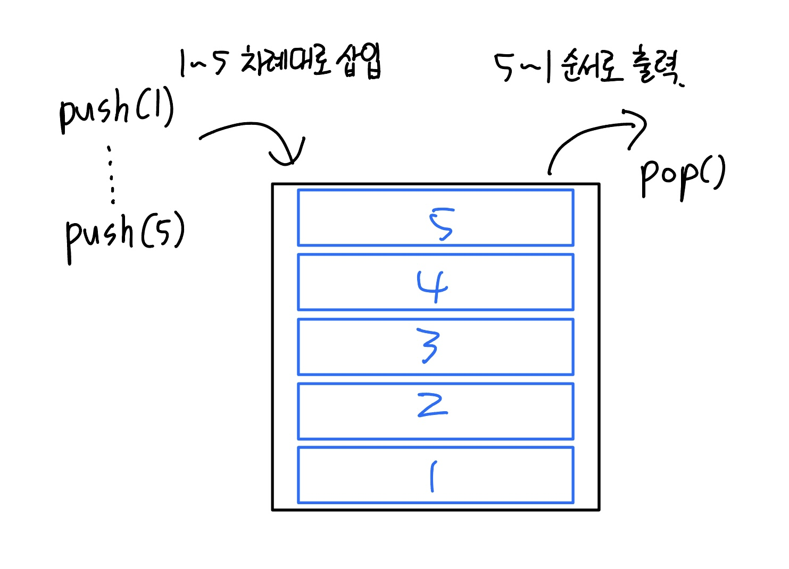
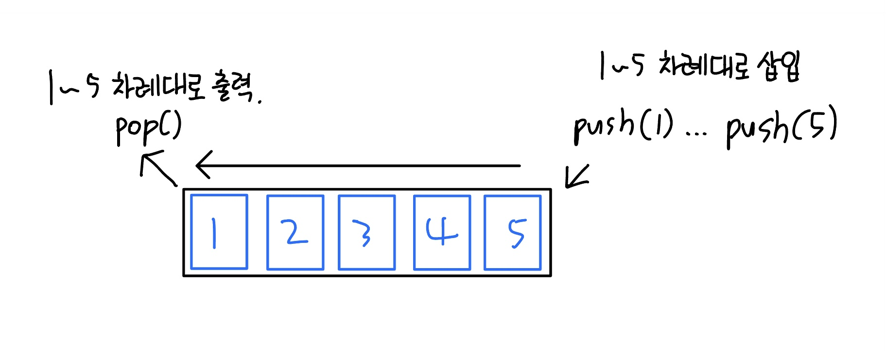

## 스택 (Stack)

### 스택이란?

- 순서대로 한쪽으로만 데이터를 넣고 뺄 수 있는 LIFO(Last Input First Output)형식의 자료구조
- stack이란 “쌓이다”, “채우다”의 어원을 두고 있음

**⇒ 어떤 자료를 쌓아서 올려놓은 형태의 자료구조**

### 스택의 특징

- 스택안에서 들어온 순서대로 차례차례 탑을 쌓는 형태로, **가장 마지막에 들어온 데이터가 제일 먼저 나가게 된다.**
- 자료의 삽입과 삭제는 같은 곳에서(top) 이루어진다.
  

### 사용 예시

- 웹 브라우저의 뒤로 가기 (페이지 정보를 스택으로 저장)
- 후위 표기법 계산

---

## 큐 (queue)

### 큐란?

- 스택과 다르게 먼저 들어온 데이터가 먼저나가는 FIFO(First input First Output)형식의 자료구조
- queue의 뜻은 “사람들이 차례를 기다리며 늘어선 줄”이라는 뜻을 가지고 있다.

**⇒ 데이터들이 일렬로 서서 기다리는 줄**

### 큐의 특징

- 들어온 순서대로 그대로 나갈 수 있는 형태의 자료구조. **가장 처음 들어온 데이터가 제일 먼저 나가게 된다.**
- 자료가 입력되고 출력되는 곳이 서로 다름. (입력 : rear, 출력 front)
  

### 사용 예시

- 프린터 출력 대기
- 은행 업무
- 프로세스 관리 (제일 간단한 FIFO구조의 스케줄링)
